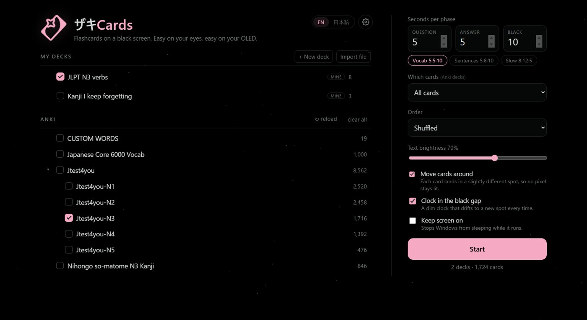
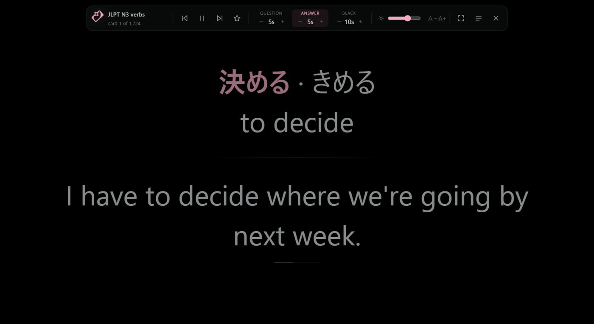
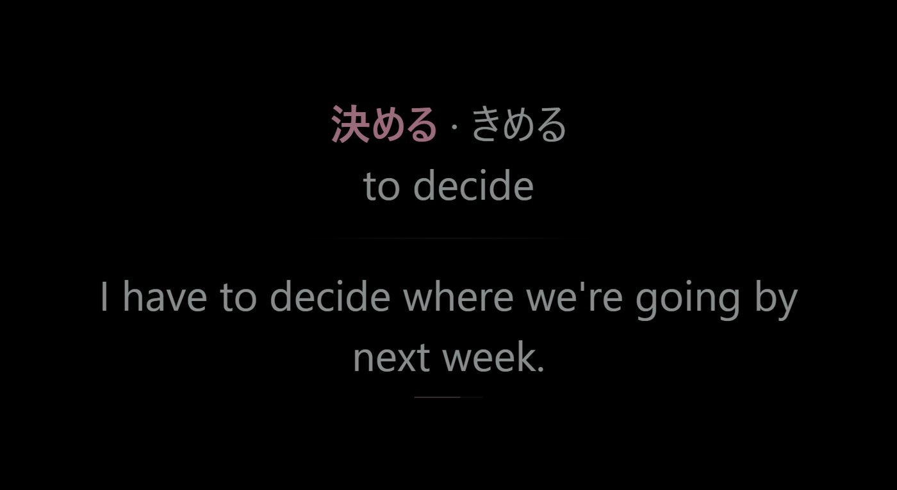
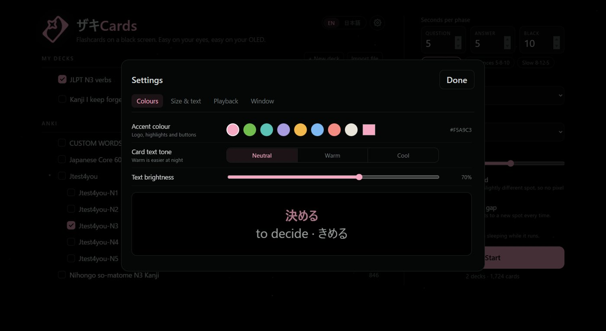

<p align="center"></p>

<h1 align="center">ザキCards</h1>
<p align="center">Flashcards on a pure black screen. Easy on your eyes, easy on your OLED.</p>
<p align="center"><a href="https://github.com/Zakede/ZakiCards/releases/latest/download/ZakiCards-win64.zip"><b>Download for Windows</b></a> · <a href="https://mannatgd.com/zakicards">Website</a></p>


I have an OLED laptop and wanted to keep studying Japanese while it sat on my desk, without a bright window burning into the panel. ザキCards shows one card at a time on pure black (question, answer, then a black gap) and never puts anything in the same spot twice.

## Features
- Plays your Anki decks: finds your profile on its own and reads a copy of the collection (subdecks, cloze, furigana, images). Your Anki data is never touched.
- Import `.apkg` packages and CSV / TXT word lists, or type your own deck (`front | back`, one per line)
- Hold the mouse on a card to keep reading, `S` to star cards you missed, sleep timer, optional drifting clock
- Settings for accent colour, card size and width, font (Gothic / Mincho / UD), animation speed and fullscreen
- English and 日本語 UI

| Deck picker | Controls |
|---|---|
|  |  |
|  |  |

## Setup
1. Download `ZakiCards-win64.zip` from [Releases](https://github.com/Zakede/ZakiCards/releases/latest) and unzip it anywhere.
2. Run `ZakiCards.exe`. It isn't code-signed yet, so Windows may show SmartScreen: **More info → Run anyway**.
3. If Anki is installed, your decks appear on their own (it reads `%APPDATA%\Anki2`). With more than one Anki profile, pick it from the dropdown next to **Anki**. Press **↻ reload** after studying in Anki.
4. Tick decks, choose timings (Vocab 5·5·10 is a good start) and press **Start**. Mouse to the top edge for controls, `Esc` for the menu.

Settings and your own decks are stored in `%APPDATA%\ZakiCards`.

## Keys
`Space` / `→` / click skip ahead · `←` previous · hold mouse to keep reading · wheel next/previous · `Enter` answer · `P` pause · `S` star · `B` black · `↑` `↓` brightness · `+` `−` text size · `F` / double-click fullscreen · `Esc` menu · `Q` quit

## Run from source
```
pip install pywebview zstandard
pythonw zakicards.pyw
```
`build.bat` makes `dist\ZakiCards\ZakiCards.exe` and the release zip.

`anki_reader.py` reads Anki's SQLite format directly (modern and legacy schemas, card templates, cloze, furigana), so no Anki code is bundled.

---
© 2026 Mannat Basra. All rights reserved (see LICENSE). "Anki" is a trademark of its owners; ザキCards is an independent app that reads Anki deck files.
